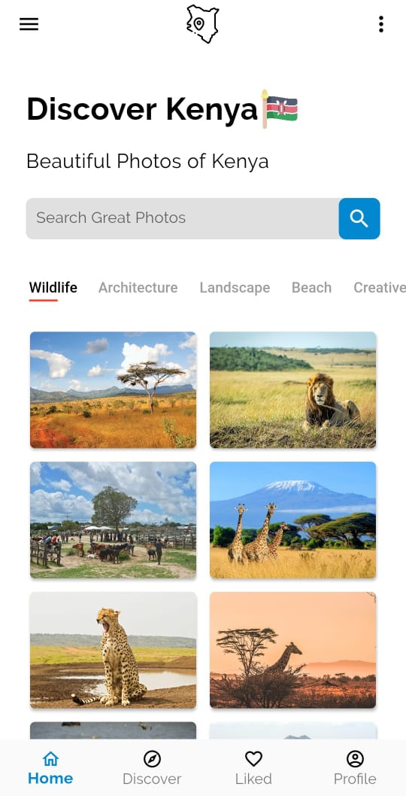
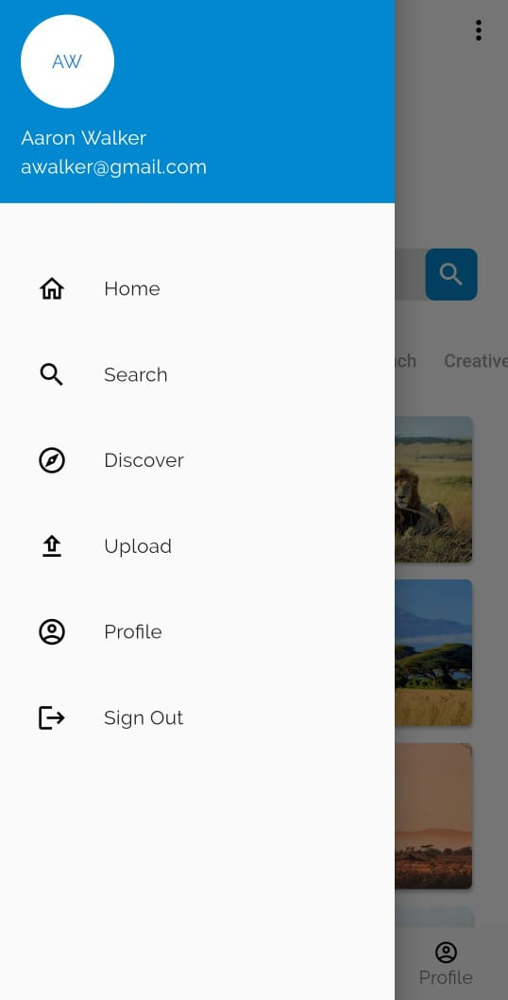

# Discover Kenya
The purpose of this project is to build a platform, Discover Kenya, on Flutter allowing users to view, upload and share visual content(e.g photos) of Kenya. 

## How to Test

- Clone the Repo
- Make sure to cd to discover_kenya
- Ensure you are running the latest version of Flutter and have set the PATH variable
- run: flutter run

# Project Screenshots

### Splash Screen

### Onboarding Screen

### Registration Screen

### Login Screen

### Home Screen

### Drawer

