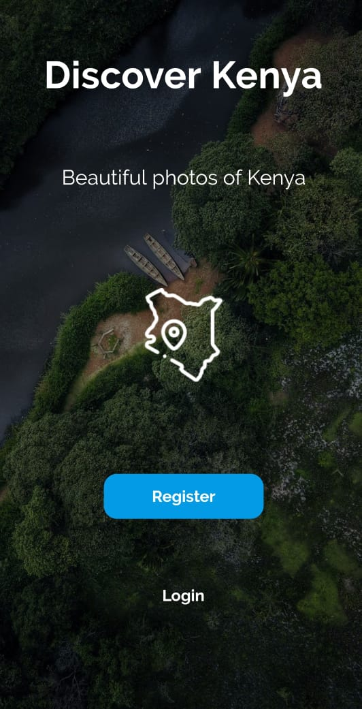
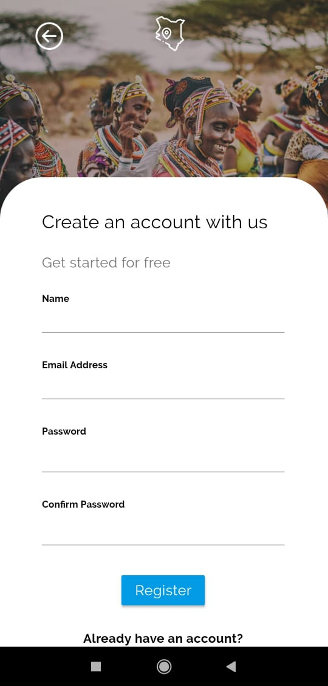
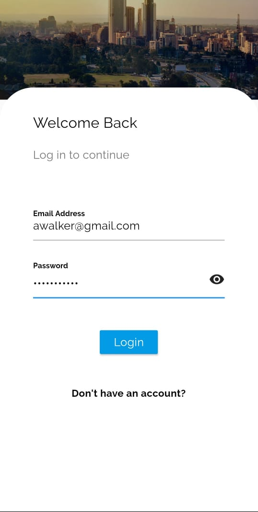
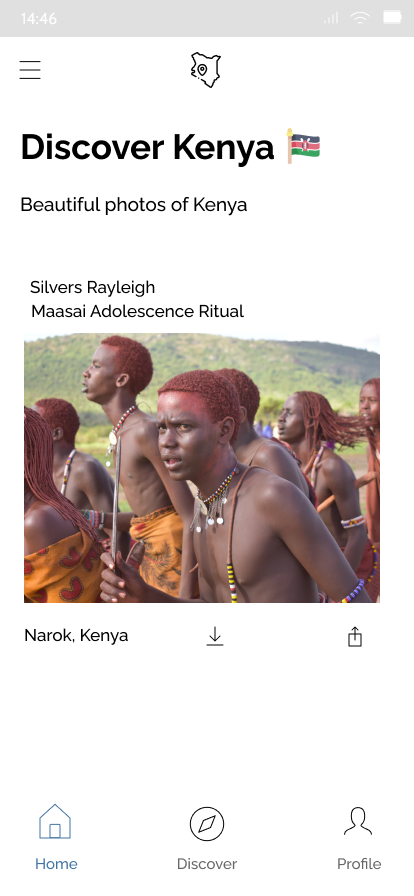
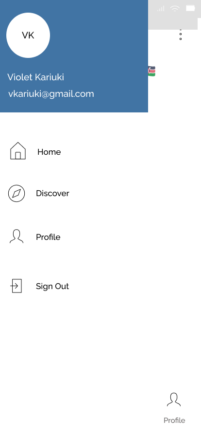

# Discover Kenya
The purpose of this project is to build a platform, Discover Kenya, on Flutter allowing users to view, upload and share visual content(e.g photos) of Kenya. To help mitigate the impact COVID-19 has had on the Kenyan tourism sector by showing off rarely visited/beautiful areas of the country and create a community of visual contributors within the Kenyan community. We intend to to monetize the app by pitching it to differnt companies like Magical Kenya , travel agencies etc.

## Functionality of the App
DK is going to be a self-contained, mobile solution built with Flutter. DK will allow users to perform numerous functions including, searching, image upload, viewing, downloading, sharing of images, etc. Our database solution, Firebase, will contain the following information: 
User Information: This includes details such as their name and email address.
Photos: We will use Firebase to store the photos uploaded by the users.
One can click on a photo to get more details about it such as destination etc.

## How to Test

- Clone the Repo
- Make sure to cd to discover_kenya and proceed to cd again to the discover_kenya.
- Ensure you are running the latest version of Flutter and have set the PATH variable
- From your terminal run: `flutter run`

# Project Screenshots

### Splash Screen

### Onboarding Screen

### Registration Screen

### Login Screen

### Home Screen

### Drawer

